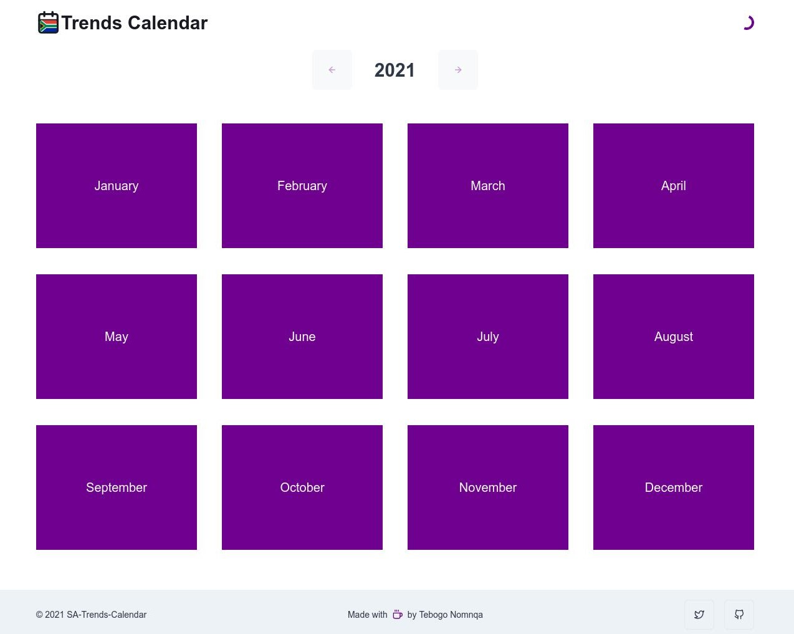

<h1 align="center">
  <br>

  <br>
 SA-Trends-Calendar
  <br>
</h1>

<h4 align="center">an open source web app 
          showing trends of the month in South Africa in the year calendar style.</h4>

<br />



## How to use

To clone and run this application, you'll need [Git](https://git-scm.com) and [Node.js](https://nodejs.org/en/download/) (which comes with [npm](http://npmjs.com)) installed on your computer. From your command line:

```bash
# Clone this repository
$ git clone https://github.com/TebzaTheMan/sa-trends-calendar
# Go into the repository
$ cd sa-trends-calendar

# Install dependencies
$ npm install

# Run the app
$ npm start
```

## Contributing

Pull requests are welcome. For major changes, please open an issue first to discuss what you would like to change.

## License

## MIT
